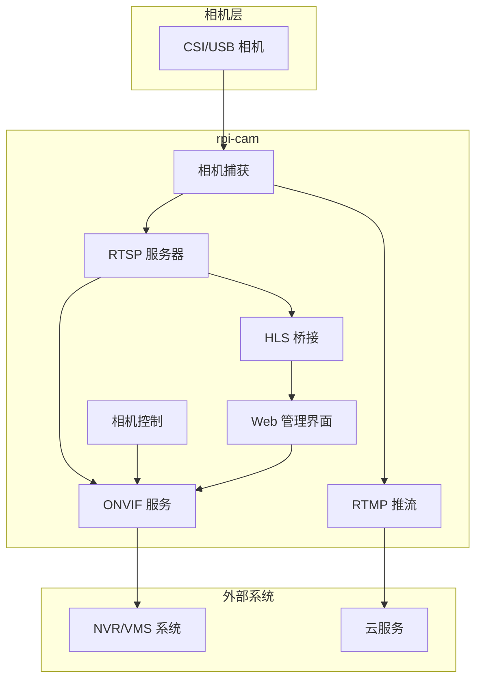

# rpi-cam

[](https://github.com/Mi-Bee-Studio/raspberrypi-camera/actions/workflows/ci.yml)
[](https://golang.org)
[](https://github.com/Mi-Bee-Studio/raspberrypi-camera/blob/main/LICENSE)

[中文文档](README_zh.md)

<div align="center">
  <table>
    <tr>
      <td align="center"><b>🪶 15–25 MB</b><br><sub>Memory footprint on RPi 3B</sub></td>
      <td align="center"><b>✅ ONVIF Profile S</b><br><sub>Device · Media · PTZ · Imaging</sub></td>
      <td align="center"><b>🔧 Zero CGO</b><br><sub>Pure Go, painless cross-compile</sub></td>
    </tr>
  </table>
</div>


rpi-cam is a lightweight Go ONVIF camera service for Raspberry Pi. It provides ONVIF Device/Media/PTZ/Imaging services, RTSP streaming, RTMP push, and WS-Discovery for NVR/VMS integration.

## Features

- **ONVIF Device/Media/PTZ/Imaging Services** - Full ONVIF compliance for NVR integration
- **RTSP Streaming** - H.264 video streaming at configurable resolutions and bitrates
- **RTMP Push** - Stream to cloud services like Aliyun, Twitch, YouTube
- **WS-Discovery** - Automatic camera discovery on the network
- **Web Admin UI** - Dark-themed admin panel with live preview, camera controls, and PTZ
- **Digital PTZ** - Pan/tilt/zoom via software cropping
- **Camera Controls** - Brightness, contrast, saturation, sharpness adjustment
- **HLS Live Streaming** - H.264 video via ffmpeg RTSP→HLS for browser playback
- **i18n Support** - English/Chinese web UI
- **Snapshot Support** - JPEG snapshots via HTTP endpoint
- **Low Memory Footprint** - ~15-30MB RAM usage
- **Cross-Platform Build** - Compile from x86 workstation to aarch64 RPi

```bash
# Clone and build
git clone https://github.com/Mi-Bee-Studio/raspberrypi-camera
cd raspberrypi-camera
make build

# Copy and configure
cp configs/config.example.yaml config.yaml
# Edit config.yaml for your camera and network

# Run directly
./build/rpi-cam -config config.yaml

# Or deploy with systemd
sudo cp deploy/rpi-cam.service /etc/systemd/system/
sudo systemctl daemon-reload
sudo systemctl enable --now rpi-cam
```

## Configuration

See `configs/config.example.yaml` for all configuration options. Key settings include:

- `camera.width/height` - Capture resolution (1280x720 default)
- `camera.fps` - Frames per second (15 default for RPi 3B)
- `camera.bitrate` - Video bitrate in bits per second
- `rtsp.port` - RTSP streaming port (8554 default)
- `onvif.port` - ONVIF HTTP/SOAP port (8080 default)
- `onvif.username/password` - ONVIF authentication credentials
- `web.enabled` - Enable Web admin UI (default: true)
- `web.port` - Web UI HTTP port (8088 default)
- `onvif.username/password` - ONVIF authentication credentials

Environment variables override any config setting with `RPICAM_` prefix:
```bash
RPICAM_ONVIF_PASSWORD=secret ./build/rpi-cam
```

## Deployment

Create a systemd service unit based on `deploy/rpi-cam.service`. Customize for your environment:

```bash
# Install and configure
sudo cp deploy/rpi-cam.service /etc/systemd/system/
# Edit paths and user for your setup
sudo systemctl daemon-reload
sudo systemctl enable --now rpi-cam
```

## Web Admin UI

The built-in web admin panel provides real-time camera management with modern streaming capabilities:

- **Live Preview** - HLS video player (hls.js library) for smooth browser playback
- **Imaging Controls** - Sliders for brightness, contrast, saturation, sharpness; dropdowns for white balance and exposure mode
- **PTZ Controls** - Directional pad for continuous movement, zoom buttons, preset management
- **Server Config** - View all configuration sections, edit ONVIF credentials with save-and-restart
- **WebSocket** - Real-time parameter and PTZ position updates without polling
- **Language Toggle** - Switch between English and Chinese interfaces
- **Theme Toggle** - Dark/light mode switching
- **Snapshot Button** - One-click JPEG capture

Access at `http://<device-ip>:8088/` with web UI credentials (token-based login). Web UI defaults reuse ONVIF credentials.

The Web UI is embedded in the binary via `//go:embed` — no additional files to deploy.
## Supported Cameras

| Module | Sensor | Resolution | Focus | DT Overlay | Notes |
|--------|--------|------------|-------|------------|-------|
| Pi Camera V1 | OV5647 | 2592×1944 | Fixed | `ov5647` | Current setup |
| Pi Camera V2 | IMX219 | 3280×2464 | Fixed | `imx219` | Better low light |
| Pi Camera V3 | IMX708 | 4608×2592 | Autofocus | `imx708` | PDAF, HDR support |
| Pi HQ Camera | IMX477 | 4056×3040 | Manual lens | `imx477` | Interchangeable lens |
| USB (UVC) | Various | Various | Various | Auto-detected | `/dev/video*` |

## Architecture


Camera capture via CSI interface supports OV5647, IMX219, IMX708, IMX477 modules. RTSP server uses `gortsplib` (same as MediaMTX). ONVIF provides device discovery, media control, PTZ operations and imaging parameter adjustment. RTMP push supports cloud services.

### Performance Comparison

| Metric | rpi-cam | MediaMTX | Improvement |
|--------|---------|----------|-------------|
| Memory Usage | **15–25 MB** | ~45 MB | 45–67% reduction |
| ONVIF Server | ✅ **Profile S** (Device/Media/PTZ/Imaging) | ❌ Not supported | — |
| CGO Dependencies | **Zero** | CGO required | Painless cross-compile |
| Camera Control | ✅ Brightness, Contrast, WB, etc. | ❌ None | — |
| RTMP Push | ✅ Built-in | ❌ Extra config needed | — |
| CPU Usage (720p@15fps) | ~15% | ~24% | 37% reduction |

*Memory usage includes ~15MB extra for HLS ffmpeg process when active.*
### Technology Stack

| Component | Library | Rationale |
|-----------|---------|-----------|
| ONVIF Server | `0x524a/onvif-go` | Pure Go, full Device/Media/PTZ/Imaging |
| RTSP Server | `bluenviron/gortsplib/v5` | Same as MediaMTX, proven compatibility |
| RTMP Push | `q191201771/lal` | Pure Go, active maintenance, low footprint |
| Camera Capture | MediaMTX rpicam (subprocess) | Battle-tested libcamera, no CGO |
| HLS Bridge | `ffmpeg` subprocess | Converts RTSP→HLS for browser playback |
| Web UI | embedded (no external lib) + hls.js | Lightweight, no external dependencies |
| Configuration | YAML | Human-readable, easy deployment |
Built with pure Go — **zero CGO**. Camera capture uses MediaMTX's existing mtxrpicam binary via subprocess pipe for proven CSI camera support, without the CGO cross-compile pain.

## Development

```bash
# Build on workstation
make build

# Cross-compile for RPi 3B
make build GOOS=linux GOARCH=arm64

# Run tests
make test

# Deploy to remote
make deploy REMOTE_HOST=user@your-rpi-host
```

## License

MIT License - see [LICENSE](LICENSE) for details.