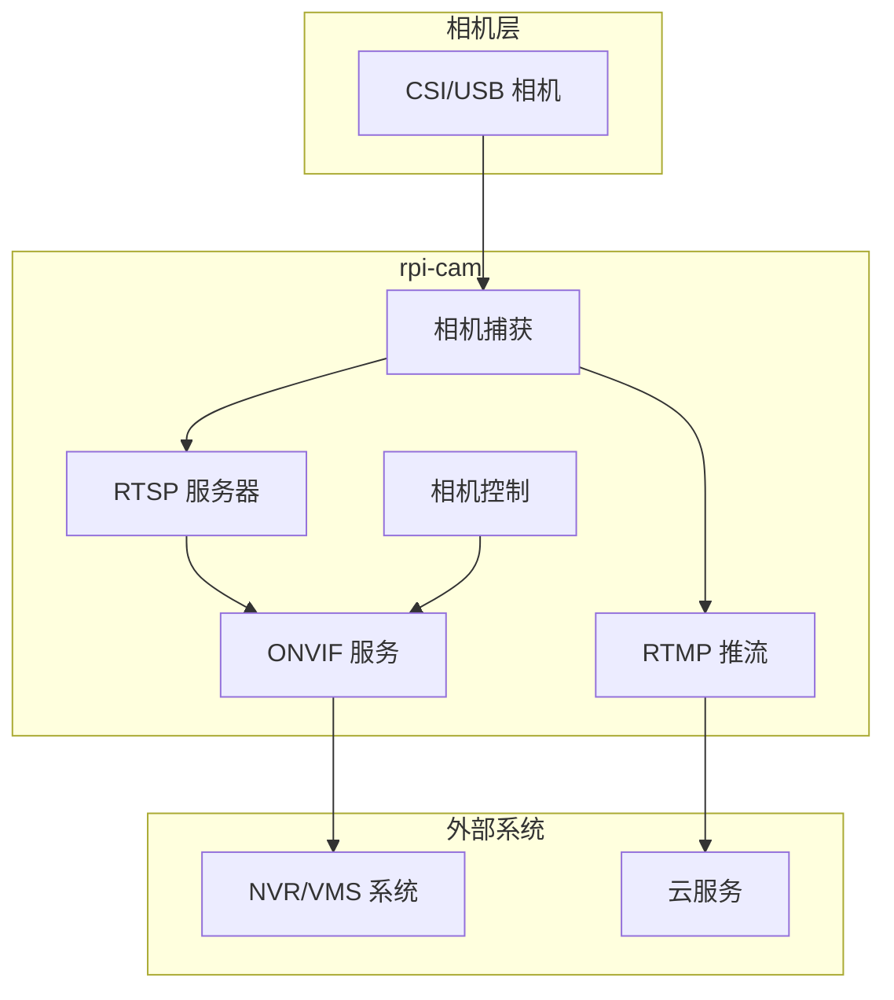

# rpi-cam

[](https://github.com/Mi-Bee-Studio/raspberrypi-camera/actions/workflows/ci.yml)
[](https://golang.org)
[](https://github.com/Mi-Bee-Studio/raspberrypi-camera/blob/main/LICENSE)

[English](README.md)

<div align="center">
  <table>
    <tr>
      <td align="center"><b>🪶 15–25 MB</b><br><sub>树莓派 3B 实测内存占用</sub></td>
      <td align="center"><b>✅ ONVIF Profile S</b><br><sub>设备 · 媒体 · PTZ · 成像</sub></td>
      <td align="center"><b>🔧 零 CGO</b><br><sub>纯 Go，交叉编译无痛</sub></td>
    </tr>
  </table>
</div>


rpi-cam 是一个轻量级的树莓派 ONVIF 相机服务，使用 Go 语言开发。它提供 ONVIF 设备/媒体/PTZ/成像服务、RTSP 流媒体、RTMP 推流和 WS-Discovery 支持，用于 NVR/VMS 集成。

## 功能

- **ONVIF 设备/媒体/PTZ/成像服务** - 完全符合 ONVIF 标准，支持 NVR 集成
- **RTSP 流媒体** - H.264 视频流，支持可配置的分辨率和码率
- **RTMP 推流** - 推送到阿里云、Twitch、YouTube 等云服务
- **WS-Discovery** - 网络自动发现相机
- **数字 PTZ** - 通过软件裁剪实现平移/倾斜/缩放
- **相机控制** - 亮度、对比度、饱和度、锐度调节
- **快照支持** - 通过 HTTP 端点获取 JPEG 快照
- **低内存占用** - 约 15-30MB RAM 使用量
- **跨平台构建** - 从 x86 工作站交叉编译到 aarch64 树莓派

## 快速开始

```bash
# 克隆并构建
git clone https://github.com/Mi-Bee-Studio/raspberrypi-camera
cd raspberrypi-camera
make build

# 复制并配置
cp configs/config.example.yaml config.yaml
# 编辑 config.yaml 配置相机和网络

# 直接运行
./build/rpi-cam -config config.yaml

# 或使用 systemd 部署
sudo cp deploy/rpi-cam.service /etc/systemd/system/
sudo systemctl daemon-reload
sudo systemctl enable --now rpi-cam
```

## 配置

查看 `configs/config.example.yaml` 了解所有配置选项。主要设置包括：

- `camera.width/height` - 采集分辨率（默认 1280x720）
- `camera.fps` - 每秒帧数（树莓派 3B 默认 15）
- `camera.bitrate` - 视频码率（比特/秒）
- `rtsp.port` - RTSP 流媒体端口（默认 8554）
- `onvif.port` - ONVIF HTTP/SOAP 端口（默认 8080）
- `onvif.username/password` - ONVIF 认证凭据

环境变量使用 `RPICAM_` 前缀覆盖任何配置设置：
```bash
RPICAM_ONVIF_PASSWORD=secret ./build/rpi-cam
```

## 部署

基于 `deploy/rpi-cam.service` 创建 systemd 服务单元。根据你的环境自定义：

```bash
# 安装和配置
sudo cp deploy/rpi-cam.service /etc/systemd/system/
# 为你的设置编辑路径和用户
sudo systemctl daemon-reload
sudo systemctl enable --now rpi-cam
```

## 支持的摄像头

| Module | Sensor | Resolution | Focus | DT Overlay | Notes |
|--------|--------|------------|-------|------------|-------|
| Pi Camera V1 | OV5647 | 2592×1944 | Fixed | `ov5647` | 当前配置 |
| Pi Camera V2 | IMX219 | 3280×2464 | Fixed | `imx219` | 更好的低光性能 |
| Pi Camera V3 | IMX708 | 4608×2592 | Autofocus | `imx708` | PDAF，HDR 支持 |
| Pi HQ Camera | IMX477 | 4056×3040 | Manual lens | `imx477` | 可更换镜头 |
| USB (UVC) | Various | Various | Various | Auto-detected | `/dev/video*` |

## 架构



相机采集通过 CSI 接口，支持 OV5647、IMX219、IMX708、IMX477 等模块。RTSP 服务器使用与 MediaMTX 相同的 gortsplib 库。ONVIF 服务提供完整的设备发现、媒体控制、PTZ 操作和图像参数调节。RTMP 推流支持云服务。

### 性能对比

| 指标 | rpi-cam | MediaMTX | 改善 |
|--------|---------|----------|-------------|
| 内存占用 | **15–25 MB** | ~45 MB | 降低 45–67% |
| ONVIF 服务端 | ✅ **Profile S**（设备/媒体/PTZ/成像） | ❌ 不支持 | — |
| CGO 依赖 | **零 CGO** | 需要 CGO | 交叉编译无痛 |
| 相机控制 | ✅ 亮度、对比度、白平衡等 | ❌ 无 | — |
| RTMP 推流 | ✅ 内置 | ❌ 需额外配置 | — |
| CPU 使用率（720p@15fps） | ~15% | ~24% | 降低 37% |

### 技术栈

| 组件 | 库 | 选择理由 |
|-----------|---------|-----------|
| ONVIF 服务端 | `0x524a/onvif-go` | 纯 Go，完整的 Device/Media/PTZ/Imaging |
| RTSP 服务器 | `bluenviron/gortsplib/v5` | MediaMTX 同款库，兼容性有保证 |
| RTMP 推流 | `q191201771/lal` | Go 原生，资源占用低，维护活跃 |
| 相机捕获 | MediaMTX rpicam（子进程） | 经过验证的 libcamera 接口，无需 CGO |
| 配置管理 | YAML | 人类可读，易于部署 |

纯 Go 构建 — **零 CGO 依赖**。相机采集通过子进程调用 MediaMTX 的 mtxrpicam 二进制文件，既利用了成熟的 libcamera 接口，又避免了 CGO 交叉编译的麻烦。

## 开发

```bash
# 在工作站构建
make build

# 交叉编译到树莓派 3B
make build GOOS=linux GOARCH=arm64

# 运行测试
make test

# 部署到远程主机
make deploy REMOTE_HOST=user@your-rpi-host
```

## 许可证

MIT License - 详见 [LICENSE](LICENSE)